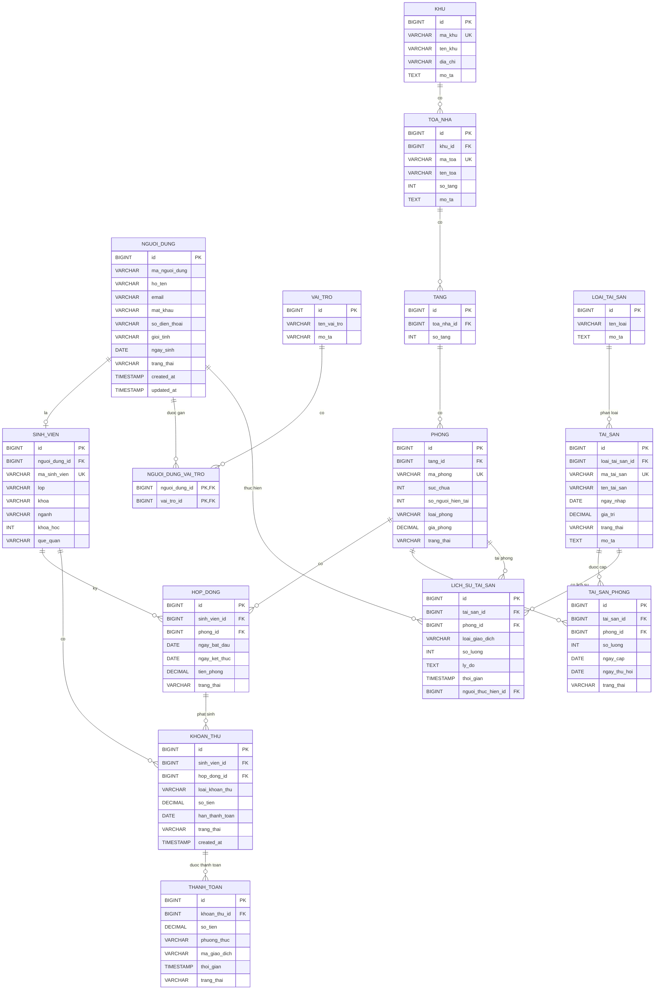

## 🗄️ ERD - Hệ thống quản lý ký túc xá

### Sơ đồ cơ sở dữ liệu

### 📌 Mô tả các nhóm bảng

| Nhóm | Các bảng | Chức năng |
|---|---|---|
| 👤 Người dùng & phân quyền | `nguoi_dung`, `vai_tro`, `nguoi_dung_vai_tro`, `sinh_vien` | Quản lý tài khoản, sinh viên và phân quyền |
| 🏢 Cơ sở vật chất | `khu`, `toa_nha`, `tang`, `phong` | Quản lý khu, tòa, tầng và phòng |
| 📝 Hợp đồng | `hop_dong` | Quản lý việc đăng ký/ở phòng của sinh viên |
| 🛏️ Tài sản | `loai_tai_san`, `tai_san`, `tai_san_phong`, `lich_su_tai_san` | Quản lý tài sản và thiết bị trong phòng |
| 💰 Khoản thu | `khoan_thu`, `thanh_toan` | Quản lý tiền phòng và các khoản thu |
